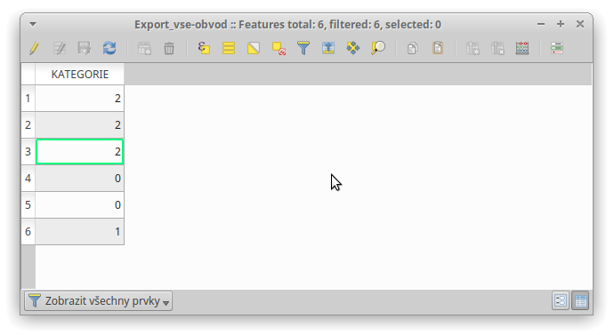

Editace
*******

Po úspěšném nahrání vrstvy parcel lze začít s editací.
Záložka :guilabel:`Editace` poskytuje nástroje k úpravě geometrie a zařazení
parcel do kategorií.

Grafické uživatelské rozhraní
-----------------------------

.. _editace-gui:

.. figure:: images/editace-gui.png

   Záložka Editace – grafické uživatelské rozhraní.

Prvek 1:
   Skupina nástrojů pro editaci, které jsou propojené se standardními nástroji
   programu QGIS.

Prvek 2:
   Rozbalovací menu s aktuálně načtenými polygonovými vrstvami.

Prvek 3:
   Tlačítko pro zobrazení dialogového, ve kterém lze zvolit adresář a název
   vrstvy obvodu. Filtruje soubory s příponou :file:`*.shp` , pamatuje si
   poslední použitou cestu.

Prvek 4:
   Rozbalovací menu s kategoriemi parcel. Na výběr jsou tyto kategorie, číslo
   v závorce udává hodnotu, kterou zásuvný modul pro kategorii používá:

      * *mimo obvod (0)*

      * *v obvodu – neřešené (1)*

      * *v obvodu – řešené (2)*

      * *bez kategorie*

Prvek 5:
   Tlačítko pro zobrazení (výběr) parcel v aktuálně zvolené kategorii.

Prvek 6:
   Rozbalovací menu s variantami zařazení parcel. K dispozici jsou dvě možnosti:

      * *vybrané parcely* – zařadí vybrané parcely do aktuálně zvolené
        kategorie.

      * *obvodem* – zařadí všechny parcely do kategorií na základě obvodu.

Prvek 7:
   Tlačítko pro provedení zařazení.

Postup
------

Zásuvný modul pracuje s aktivní vrstvou, tj. vrstva vybraná v panelu vrstev,
který se ve výchozím nastavení nachází na levé straně okna.

Vrstvu parcel můžete editovat pomocí sady standardních nástrojů v horní části
pluginu (prvek 1).

Nejdůležitější funkcionalitou této záložky je ovšem zařazení parcel
do kategorií. Aby bylo na první pohled zřejmé, ve které kategorii jsou
jednotlivé parcely zařazeny, používá zásuvný modul tzv. vrstvu obvodu. Jedná se
o samostatnou vrstvu ve formátu *shapefile*. Adresář a název této vrstvy můžete
specifikovat pomocí tlačítka :guilabel:`Vytvořit` (prvek 3). Po poklepání
na zmíněné tlačítko se otevře dialogové okno, kde lze zvolit umístění vrstvy
obvodu. Z aktivní vrstvy, která musí být VFK, se vytvoří vrstva obvodu, zásuvný
modul ji načte a vybere v rozbalovacím menu (prvek 2).

Pokud cesta k vrstvě obvodu není definována (rozbalovací menu je prázdné), nebo
je v rozbalovací menu vybrána vrstva, která nebyla vytvořena zásuvným modulem
a tudíž neobsahuje potřebné sloupce, plugin automaticky vytvoří vrstvu obvodu
ve stejném adresáři, ve kterém se nachází aktivní vrstva parcel.

Funkce pro vytvoření obvodu je volána v momentě, kdy je pro vrstvu parcel
uložena změna geometrie, potvrzena editace, při které došlo k vymazání prvku,
nebo je pomocí tlačítka :guilabel:`Zařadit` (prvek 7) provedeno zařazení parcel.

Zásuvný modul nabízí dvě varianty zařazení parcel (prvek 6). První možností je
volba *vybrané parcely*, která provede zařazení vybraných parcel do zvolené
kategorie (prvek 4).

Druhý způsob nazvaný *obvodem* rozřadí všechny parcely ve VFK vrstvě
do kategorií. Jako podklad použije aktuálně vybranou vrstvu obvodu
(viz prvek 2). Tato varianta pracuje pouze s obvody, které vytvořil zásuvný
modul pro pozemkové úpravy. Pro zařazení do kategorie musí být parcela kompletně
uvnitř geometrie příslušného prvku obvodu.

Pro kontrolu nabízí zásuvný modul tlačítko :guilabel:`Zobrazit` (prvek 5),
které vybere, a tím pádem zvýrazní, prvky v kategorii.

Pokud vytvoříte novou parcelu, nebo pomocí nástroje *Přidat část* doplníte
popisné údaje o geometrii, vyplňte měřítko podkladů do sloupce
``MERITKO PODKL.``. Tento údaj používá kontrola *výměra nad mezní odchylkou*.

Symbologie vrstvy obvodu
------------------------

Pro symbologii vrstvy obvodu byla zvolena červená barva, popisky obsahují pouze
číslo kategorie.

   Symbologie vrstvy obvodu.

Atributová tabulka vrstvy obvodu
--------------------------------

Vrstva obvodu se vytváří z vrstvy parcel, ovšem pouze informace o kategorii je
pro obvod relevantní. Z toho důvodu je viditelný pouze sloupec ``KATEGORIE``.

   Atributová tabulka vrstvy obvodu.
