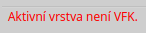
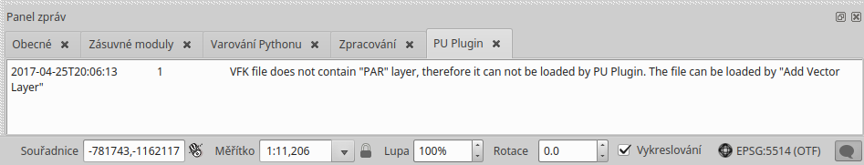

Komunikace s uživatelem
***********************

Zásuvný modul komunikuje s uživatelem třemi způsoby:

*   **Stavový řádek** představuje nejčastější způsob zobrazování zpráv
    zásuvného modulu. Když nevíte jak postupovat, zde s největší
    pravděpodobností najdete potřebné informace. Běžné zprávy mají černou barvu
    písma, důležité zprávy se zobrazují červeně.

   Stavový řádek – důležitá zpráva

*   **Pole zpráv** je standardní způsob komunikace mezi programem QGIS
    a uživatelem. Zobrazuje pole v horní části mapového okna, které může být
    nastaveno tak, že po určité době samo zmizí, nebo vyžaduje manuální
    zavření. Zásuvný modul využívá této komunikace pouze pro zobrazení
    významných zpráv, které by neměly být uživatelem opomenuty.

   Pole zpráv – zpráva upozornění

*   **Logování** je posledním prostředkem pro předávání informací, který
    zásuvný modul používá. Informace v anglickém jazyce, zejména chybové
    hlášky, zapisuje do vlastní záložky s názvem :guilabel:`PU Plugin`. Panel
    logovacích zpráv můžete zobrazit kliknutím na ikonu |logovacipanel|
    v pravém dolním rohu QGISu.

      .. |logovacipanel| image:: images/komunikace-otevrit_logovaci_panel.png

   Panel logovacích zpráv
