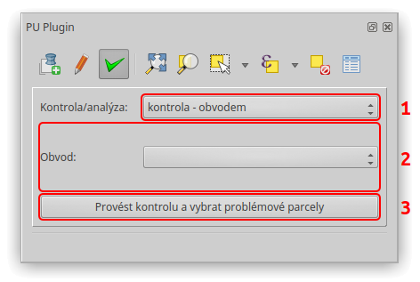
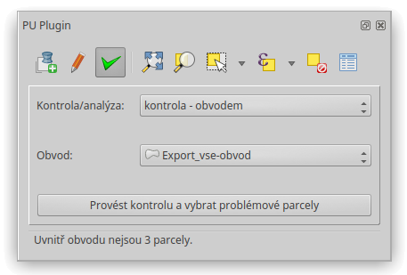
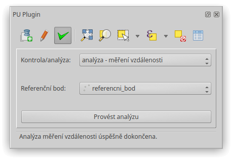
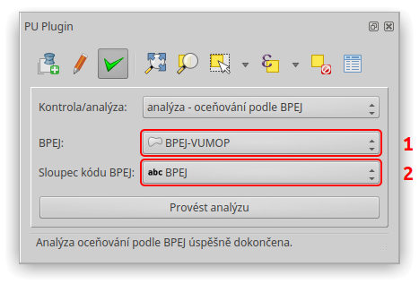

Kontroly a analýzy
******************

Poslední záložka zásuvného modulu nabízí možnost zkontrolovat data, zejména
soulad mezi SPI, SGI, a provést analýzy nezbytné pro sestavení nárokových
listů.

Grafické uživatelské rozhraní
-----------------------------

   Záložka Kontroly a analýzy – grafické uživatelské rozhraní.

Prvek 1:
   Rozbalovací menu pro přepínání mezi kontrolami a analýzami.

Prvek 2:
   Okna kontrol a analýz zobrazující se v závislosti na tom, která položka
   rozbalovacího menu (prvek 1) je vybrána.

Prvek 3:
   Tlačítko pro provedení kontroly či analýzy.

Postup
------

V rozbalovacím menu (prvek 1) zvolte kontrolu či analýzu, důsledkem čehož se
změní dolní okno (prvek 2). Když je vše potřebné zadané, lze kontrolu či analýzu
spustit. Zprávy ve stavovém řádku poskytují informace o výsledku.

Kontrola - obvodem
------------------

Kontrola *obvodem* provádí výběr parcel, které nejsou kompletně uvnitř vrstvy
obvodu.

Jestliže od začátku pracujete pouze s jednou vrstvou obvodu, měl by být výsledek
této kontroly stejný jako při zvolení kategorie *bez kategorie* (prvek 4
v záložce :ref:`Editace <editace-gui>`) a provedení výběru prvků v kategorii
pomocí tlačítka :guilabel:`Zobrazit` (prvek 5 v záložce
:ref:`Editace <editace-gui>`). Lišit se tyto dvě metody budou v případě,
že si do QGISu nahrajete vrstvu obvodu, kterou jste vytvořili s jinou vrstvou
parcel. Jinými slovy tato kontrola používá geometrii vrstvy obvodu a tlačítko
:guilabel:`Zobrazit` v záložce Editace vybírá parcely na základě údajů uložených
v atributové tabulce.

Jediným potřebným vstupem je zmiňovaná vrstva obvodu v rozbalovacím menu,
které je propojené s menu vrstvy obvodu v záložce :ref:`Editace <editace-gui>`.

   Kontrola obvodem – grafické uživatelské rozhraní.

Kontrola - není v SPI
---------------------

Kontrola *není v SPI* slouží k zobrazení parcel, které nejsou v souboru
popisných informací.

Kontrola - není v mapě
----------------------

Kontrola *není v mapě* vybírá parcely, které mají nulovou geometrii a tudíž
se nezobrazují v mapovém okně.

Kontrola - výměra nad mezní odchylkou
-------------------------------------

Kontrola *výměra nad mezní odchylkou* ověřuje, zda rozdíl mezi výměrou dle SPI
a výměrou vypočtenou z SGI nepřekračuje mezní odchylku. Ta je stanovena
katastrální vyhláškou a závisí na kódu kvality nejméně přesně určeného lomového
bodu na hranici parcely. Jestliže je parcela digitalizovaná, kód kvality
podrobných bodů se určí podle měřítka podkladové mapy, viz sloupec
``MERITKO PODKL.``.

Kontrola - bez vlastníka
------------------------

Kontrola *bez vlastníka* vybírá parcely, které jsou bez vlastníka,
tzn. že nemají přiřazený list vlastnictví.

Analýza - měření vzdálenosti
----------------------------

Analýza *měření vzdálenosti* počítá pro všechny řešené parcely vzdálenost jejich
těžiště od referenčního bodu. Výsledné zaokrouhlené hodnoty v metrech ukládá
do sloupce ``VZDALENOST``.

Pro spuštění této kontroly je zapotřebí v rozbalovacím menu, které filtruje
bodové vrstvy, zvolit vrstvu referenčního bodu. Vybraná vrstva referenčního
bodu musí obsahovat právě jeden prvek a musí mít stejný souřadnicový systém jako
vrstva parcel.

   Analýza měření vzdálenosti – grafické uživatelské rozhraní.

Analýza - oceňování podle BPEJ
------------------------------

Analýza oceňování podle BPEJ počítá cenu pozemku na základě vrstvy hranic
BPEJ.

   Analýza oceňování podle BPEJ – grafické uživatelské rozhraní.

Prvek 1:
   Rozbalovací menu s aktuálně načtenými polygonovými vrstvami.

Prvek 2:
   Rozbalovací menu se sloupci vybrané vrstvy BPEJ.

Vyberte vrstvu hranic BPEJ (prvek 1) a poté zvolte sloupec, ve kterém jsou
uloženy kódy BPEJ. Vrstva hranic BPEJ musí mít stejný souřadnicový systém jako
vrstva parcel.

Pro určení ceny za metr čtvereční jednotlivých kódů BPEJ analýza používá
číselník BPEJ z *Českého úřadu zeměměřičského a katastrálního*.

Do atributové tabulky se zapíše nejen cena celková (sloupec ``CELK. CENA``),
ale také cena za metr čtvereční, výměra a cena dle jednotlivých bonit
v příslušné parcele (sloupec ``BPEJ KOD-CENA ZA M2-VYMERA-CENA``).

Pokud omylem zvolíte špatný sloupec, nebo když kód BPEJ není nalezen
v číselníku, zásuvný modul vybere ve vrstvě obvodu prvky, pro které nenalezl
ceny, a informuje vás o problému.
