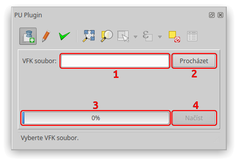
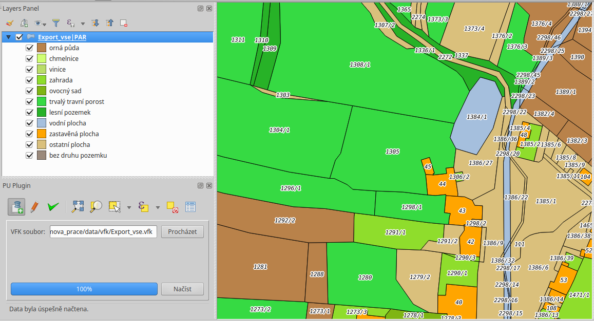
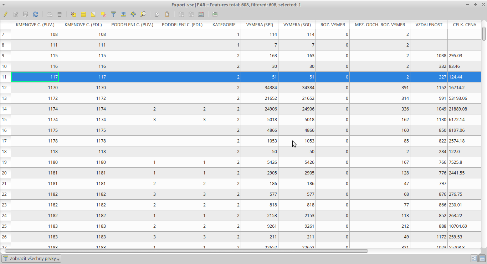

Načtení VFK souboru
*******************

Záložka :guilabel:`Načtení VFK souboru` slouží k načtení vrstvy parcel
ze souboru VFK.

Grafické uživatelské rozhraní
-----------------------------

   Záložka Načtení VFK souboru – grafické uživatelské rozhraní.

Prvek 1:
   Textové pole pro cestu k VFK souboru.

Prvek 2:
   Tlačítko pro zobrazení dialogového okna pro procházení adresářů. Filtruje
   soubory s příponou :file:`*.vfk` , pamatuje si poslední použitou cestu.

Prvek 3:
   Indikátor průběhu načítání VFK souboru.

Prvek 4:
   Tlačítko pro načítání VFK souboru. Aktivuje se pouze v případě, že textové
   pole (prvek 1) obsahuje cestu k existujícímu VFK souboru.

Postup
------

Nejprve je zapotřebí zvolit VFK soubor, který chcete načíst. To lze udělat dvěma
způsoby. Buď kliknete na tlačítko :guilabel:`Procházet` (prvek 2), vyberete
požadovaný soubor a cesta k souboru se automaticky zapíše do textového pole
(prvek 1), nebo zkopírujete cestu k VFK souboru přímo do zmíněného textové pole.

Když se v textovém poli nachází cesta k validnímu VFK souboru, aktivuje se
tlačítko :guilabel:`Načíst` (prvek 4) a můžete zahájit import.

O průběhu načítání vás informuje indikátor průběhu (prvek 3) a zprávy
ve stavovém řádku.

.. note:: Vstupní VFK soubor musí obsahovat vrstvu parcel (PAR).

.. tip:: Vzorová data si můžete stáhnout
         `zde
         <http://www.cuzk.cz/Katastr-nemovitosti/Poskytovani-udaju-z-KN/
         Vymenny-format-KN/Vymenny-format-NVF/exportvse.aspx>`__.

Symbologie vrstvy parcel
------------------------

Symbologie načtené vrstvy parcel se řídí podle druhu pozemku.
Při měřítku 1:4000 a větším přiblížení se zobrazí parcelní čísla.

   Symbologie vrstvy parcel.

Atributová tabulka vrstvy parcel
--------------------------------

Zásuvný modul v atributové tabulce kvůli přehlednosti skrývá všechny nepotřebné
sloupce. Pro větší srozumitelnost mají viditelné sloupce aliasy.

   Atributová tabulka vrstvy parcel.
